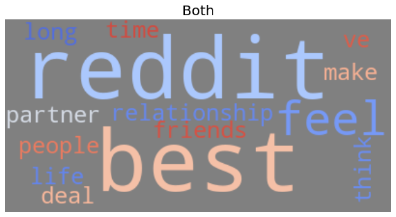
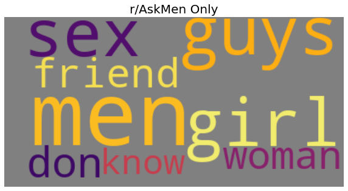
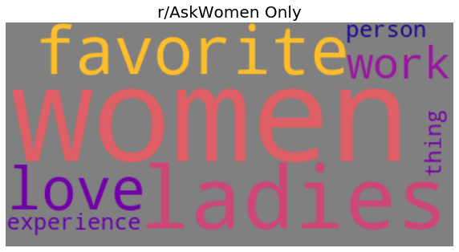
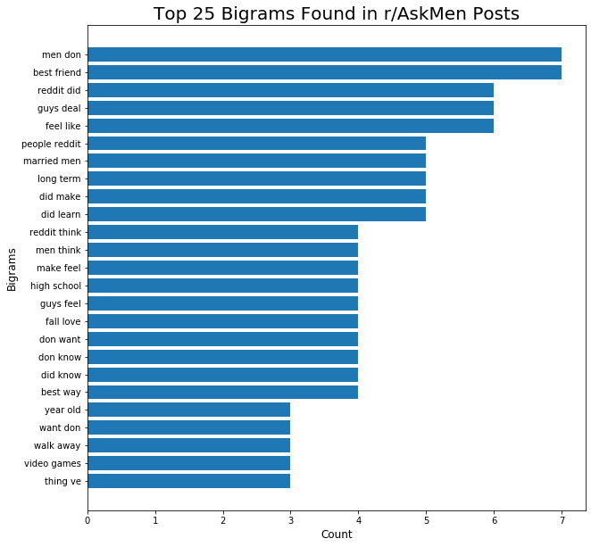
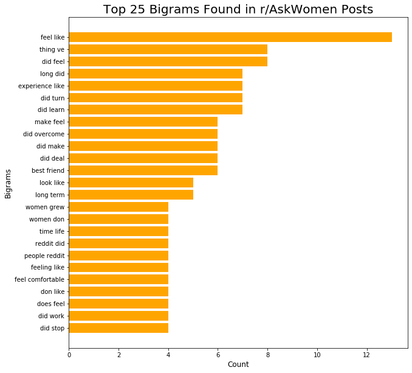
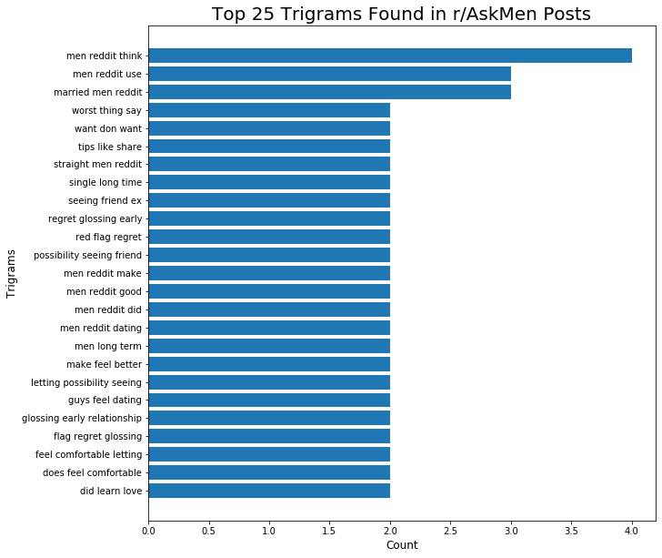
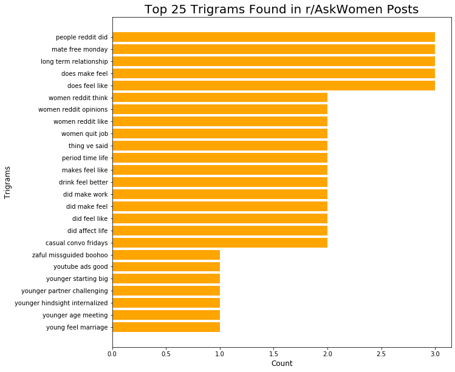
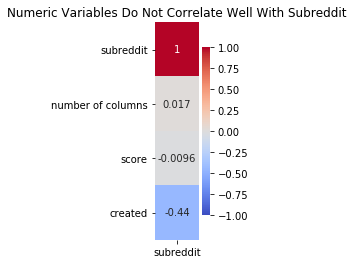

# Project 3: Web APIs & NLP
#### Project completed by Matt Williams
#### July 24th, 2020

### Problem Statement:

I will be exploring how to create classification models using text data and Natural Language Processing (NLP). I have collected text data on posts from two different Subreddits - [r/AskMen](https://www.reddit.com/r/AskMen/) and [r/AskWomen](https://www.reddit.com/r/AskWomen/). I will use different techniques to prepare the data for modeling, and explore how several classification models peform in an effort to predict from which Subreddit a given post came.

---

### Contents:
- [Data Sources & Dictionary](#Data_Sources)
- [Data Cleaning](#Data_Cleaning)
- [Exploratory Data Analysis](#Exploratory_Data_Analysis)
- [Modeling](#Modeling)
- [Presentation](#Presentation)
- [Conclusions and Recommendations](#Conclusions_and_Recommendations)

---

### Data Sources & Dictionary

I collected the data using the Python Reddit API Wrapper ([PRAW](https://praw.readthedocs.io/en/latest/)). The posts collected are the most recent posts from each subreddit at the time PRAW was run. There are 1983 total observations - 983 from r/AskMen and 980 from r/AskWomen. 

One feature was generated. The 'subreddit' column is a binary indicator for the subreddit of origin for a post.

The data dictionary is outlined below:

| Feature   | Data Type | Summary                                                                                                                              |
|-----------|-----------|--------------------------------------------------------------------------------------------------------------------------------------|
| title     | Object    | Text for title of post                                                                                                               |
| score     | Integer   | The difference between the number of  upvotes (positive votes) for a post  and the number of downvotes (negative  votes) for a post. |
| url       | Object    | Url for undividual posts                                                                                                             |
| comms_num | Integer   | Number of comments on a post                                                                                                         |
| created   | Float     | Timestamp for when the post was  created                                                                                             |
| body      | Object    | Supporting text for the post                                                                                                         |
| subreddit | Integer   | 0 = r/AskMen; 1 = r/AskWomen   

The datasets can be found below:

- [Combined data](./data/AskMen_AskWomen.csv)
- [r/AskMen data](./datasets/askmen.csv)
- [r/AskWomen data](./datasets/askwomen.csv)

---

### Data Cleaning

There was not a need for much data cleaning. One potentially useful column - 'body' - contained nearly 60% null values. I did experiment with replacing the nulls to use this column in my analysis, but this data did not have an impact on the models. Thus, it was left as is and not used in the analysis. 

---

### Exploratory Data Analysis

I began analyzing the data from individual subreddits. I was interested in finding out what the most commonly used words, bigrams, and trigrams were in each set to see if there is an obvious difference in the language that is used in the subreddits. To accomplish this, text was run through Count Vectorizer and English stop words were removed. 

#### Top Words

I created wordclouds for each subreddit to examine the top 25 words. I broke this down by the top words the subreddits had in common and words that were unique to each.

> Top words in common: 

 

> r/AskMen only:

 

> r/AskWomen only:

 

We see that there is a lot of overlap in the words that each subreddit have in common (nearly 60% of the top 25 words). Interestingly, r/AskMen users make frequent mention of the opposite sex while r/AskWomen users do not. 

#### Top Bigrams

Next, I looked at the most common pairs of words used in the text:

> r/AskMen bigrams:

 

> r/AskWomen bigrams

 

There are still quite a few pairs of words in common - nearly 40% - but there are a few differences that stand out ("video games," for example, is common in r/AskMen but not in r/AskWomen).

#### Top Trigrams

I then looked at the top triplets of words:

> r/AskMen:

 

> r/AskWomen:

 

I will use individual words, bigrams, and trigrams in my models to see which n-gram leads to the best models. 

#### Exploring Numeric Variables

I created a heatmap to explore the relationships between our numerical columns with our target:

There is little to no correlation with our target. Thus, we will use only text data for modeling - specifically our 'title' column. 

---

### Modeling

I used the 'title' column to predict our target, 'subreddit.' The accuracy metric was used for model evaluation.

First, I define the baseline model. Our baseline accuracy is 0.5007 - since we have ideally balanced classes, it is basically a coin flip. Any model built must improve upon this score. 

The models used were logistic regression, multinomial naive Bayes, random forests and extremely random trees. For each model, I used both the count and TF-IDF vectorizers. I initially gridsearched over a number of hyperparameters to try to find the most accurate model, but decided to take a more methodical approach.

I defined a baseline score for each of these eight models by running each model with default hyperparameters: 

| Model               | Vectorizer | Best Cross Val  Accuracy | Training Accuracy | Test Accuracy |
|---------------------|------------|:------------------------:|-------------------|---------------|
| Logistic Regression | TF-IDF     | 0.6997                   | 0.8987            | 0.6904        |
| Extra Trees         | TF-IDF     | 0.6877                   | 0.9905            | 0.6925        |
| Multinomial NB      | Count      | 0.6868                   | 0.9171            | 0.6762        |
| Logistic Regression | Count      | 0.6834                   | 0.9552            | 0.7088        |
| Random Forest       | Count      | 0.6800                   | 0.9905            | 0.6965        |
| Random Forest       | TF-IDF     | 0.6793                   | 0.9905            | 0.6823        |
| Multinomial NB      | TF-IDF     | 0.6712                   | 0.9300            | 0.6639        |
| Extra Trees         | Count      | 0.6692                   | 0.9905            | 0.7006        |

The models are very overfit. I decided to use the models that produced the two best cross val scores using default parameters for further analysis. To complete this, I gridsearched over a number of different hyperparameters for both the vectorizer and the classifier. 

#### Logistic Regression using TF-IDF Vectorizer

The following hyperparameters produced the best model:

> TF-IDF Max Features: 1,000
>
> TF-IDF Max DF: .9
>
> TF-IDF Min DF: 2
>
> TF-IDF N-gram Range: (1,1) - individual words
>
> TF-IDF Stop Words: None

Using these hyperparameters, I was able to decrease varaince in the model. The training accuracy was 0.8397 and the test accuracy was 0.7026. The model is still overfit, but I was able to reduce overfitting while improving the results on my testing data.

#### Extremely Random Trees with TF-IDF Vectorizer

The following hyperparameters produced the best model:

> TF-IDF Max Features: 500
>
> TF-IDF N-gram Range: (1,1) - individual words
>
> TF-IDF Stop Words: None
>
> Extra Trees Max Depth: 4
>
> Extra Trees Estimators: 125

Using these hyperparameters, I was able to decrease varaince in the model. The training accuracy was 0.8016 and the test accuracy was 0.6965. The model is still overfit, but I was able to reduce overfitting better than with any other model while slightly improving the results on my testing data. 

---

### Presentation

The presentation on the study can be found here: [Presentation](./deck.pdf) 

---

### Conclusions and Recommendations

Ultimately, it proved to be a challenge to predict whether a post was from r/AskMen or r/AskWomen. This is likely due to the language and themes used in the subreddits being surprisingly similar. 

To increase model performance, I could aim to use more tools on the data during preprocessing (lemmatizing, stemming, etc.). It would also be worthwhile to identify ways to take context or sentiment into consideration - while there are many words in common amongest the subreddits, I may be able to improve accuracy if I were able to search to the left or right of the words for clues on how the words are really being used (I tried to accomplish this by using bigrams and trigrams in my models to try to accomplish this, but individual words were always the hyperparameter chosen in the best models). Other ways to improve the models would be to collect more data - whether that be more obeservations, or collecting comments. Finally, I would like to experiment with other classifier models to see if they may increase accuracy. 